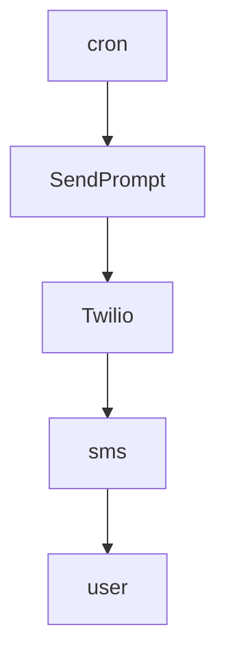
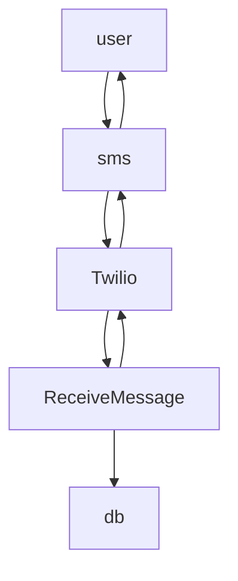

# 🙏 Gratitude Journal

A serveless app powered by Twilio and Microsoft Azure functions that sends a daily gratitude SMS prompt. The user's responses are saved in an Azure SQL Server database.

## 🚀 Technologies

- [TypeScript](https://www.typescriptlang.org/)
- [Twilio](https://twilio.com/)
- [Azure Functions](https://azure.microsoft.com/en-us/services/functions)
- [Azure SQL Database](https://azure.microsoft.com/en-us/products/azure-sql/database)
- [Prisma](https://www.prisma.io/)

## 🛠 Setup

Fist, clone this repository and install the project's dependencies.

```bash
git clone https://github.com/lucasamonrc/gratitude-journal.git
cd gratitude-journal
npm i
```

Create an `.env` file just like the `example.env`, and put your respective variables.

Also, make sure you have the [Azure Functions](https://github.com/features/actions) VSCode extension installed.

You should be able to start a local development instance by pressing "F5", or by running the debugger.

## 🔌 How it works

These app defines two cloud functions, `SendPrompt` and `ReceiveMessage`.

1. `SendPrompt` is triggered on a cron schedule, it uses Twilio's SDK to programmatically send a text message to my personal number.



2. When I receive the SMS sent by `SendPrompt`, I am able to reply back with my daily response. Twilio will receive the SMS reply and then will call `ReceiveMessage` through a webhook, passing to it the contents of the SMS message. `ReceiveMessage` then process the contents and saves it to a SQL Database deployed to Azure using Prisma ORM. Finally, it then sends a response back to Twilio confirming that my responses were saved. Twilio repasses this message as another SMS to me.



## 📋 Meta

Lucas Castro – [lucasamonrc.dev](https://www.lucasamonrc.dev) – lucasamonrc@gmail.com

[@lucasamonrc](https://github.com/lucasamonrc)
